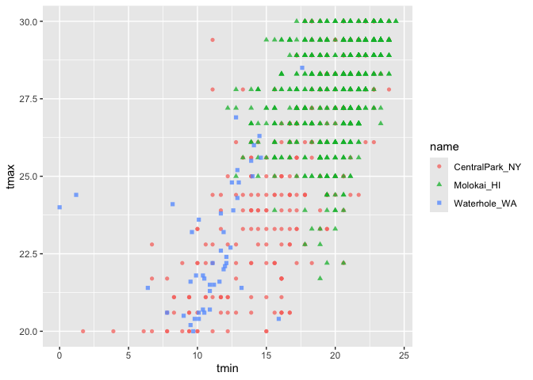
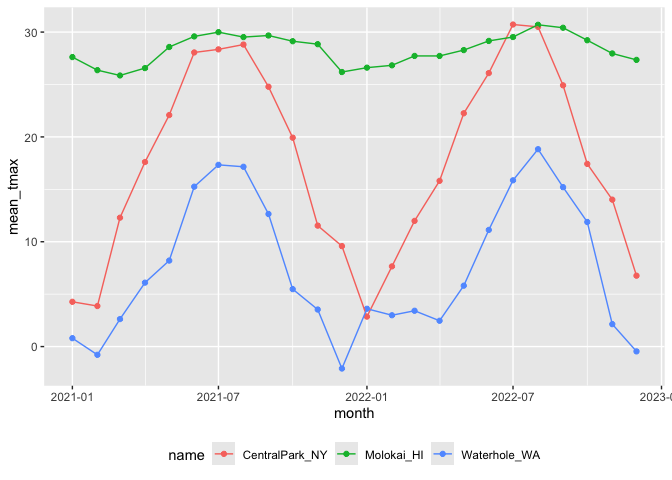

EDA
================

``` r
library(tidyverse)
```

    ## ── Attaching core tidyverse packages ──────────────────────── tidyverse 2.0.0 ──
    ## ✔ dplyr     1.1.4     ✔ readr     2.1.5
    ## ✔ forcats   1.0.0     ✔ stringr   1.5.1
    ## ✔ ggplot2   3.5.1     ✔ tibble    3.2.1
    ## ✔ lubridate 1.9.3     ✔ tidyr     1.3.1
    ## ✔ purrr     1.0.2     
    ## ── Conflicts ────────────────────────────────────────── tidyverse_conflicts() ──
    ## ✖ dplyr::filter() masks stats::filter()
    ## ✖ dplyr::lag()    masks stats::lag()
    ## ℹ Use the conflicted package (<http://conflicted.r-lib.org/>) to force all conflicts to become errors

``` r
library (patchwork)
```

\##Load the weather data

``` r
weather_df = 
  rnoaa::meteo_pull_monitors(
    c("USW00094728", "USW00022534", "USS0023B17S"),
    var = c("PRCP", "TMIN", "TMAX"), 
    date_min = "2021-01-01",
    date_max = "2022-12-31") |>
  mutate(
    name = case_match(
      id, 
      "USW00094728" ~ "CentralPark_NY", 
      "USW00022534" ~ "Molokai_HI",
      "USS0023B17S" ~ "Waterhole_WA"),
    tmin = tmin / 10,
    tmax = tmax / 10,
month = floor_date(date, unit = "month")) |>
  select(name, id, everything())
```

    ## using cached file: /Users/Tammy/Library/Caches/org.R-project.R/R/rnoaa/noaa_ghcnd/USW00094728.dly

    ## date created (size, mb): 2024-09-26 20:34:18.576194 (8.651)

    ## file min/max dates: 1869-01-01 / 2024-09-30

    ## using cached file: /Users/Tammy/Library/Caches/org.R-project.R/R/rnoaa/noaa_ghcnd/USW00022534.dly

    ## date created (size, mb): 2024-09-26 20:34:36.21331 (3.932)

    ## file min/max dates: 1949-10-01 / 2024-09-30

    ## using cached file: /Users/Tammy/Library/Caches/org.R-project.R/R/rnoaa/noaa_ghcnd/USS0023B17S.dly

    ## date created (size, mb): 2024-09-26 20:34:42.357773 (1.036)

    ## file min/max dates: 1999-09-01 / 2024-09-30

\##Initial numeric explorations

``` r
weather_df |> 
  ggplot(aes(x = prcp)) + 
  geom_histogram()
```

    ## `stat_bin()` using `bins = 30`. Pick better value with `binwidth`.

    ## Warning: Removed 15 rows containing non-finite outside the scale range
    ## (`stat_bin()`).

<!-- -->

``` r
weather_df |> 
  filter(prcp >= 1000)
```

    ## # A tibble: 3 × 7
    ##   name           id          date        prcp  tmax  tmin month     
    ##   <chr>          <chr>       <date>     <dbl> <dbl> <dbl> <date>    
    ## 1 CentralPark_NY USW00094728 2021-08-21  1130  27.8  22.8 2021-08-01
    ## 2 CentralPark_NY USW00094728 2021-09-01  1811  25.6  17.2 2021-09-01
    ## 3 Molokai_HI     USW00022534 2022-12-18  1120  23.3  18.9 2022-12-01

``` r
weather_df |> 
  filter(tmax >= 20, tmax <= 30) |> 
  ggplot(aes(x = tmin, y = tmax, color = name, shape = name)) + 
  geom_point(alpha = .75)
```

<!-- -->

## Group_by()

``` r
weather_df |>
  group_by(name, month)
```

    ## # A tibble: 2,190 × 7
    ## # Groups:   name, month [72]
    ##    name           id          date        prcp  tmax  tmin month     
    ##    <chr>          <chr>       <date>     <dbl> <dbl> <dbl> <date>    
    ##  1 CentralPark_NY USW00094728 2021-01-01   157   4.4   0.6 2021-01-01
    ##  2 CentralPark_NY USW00094728 2021-01-02    13  10.6   2.2 2021-01-01
    ##  3 CentralPark_NY USW00094728 2021-01-03    56   3.3   1.1 2021-01-01
    ##  4 CentralPark_NY USW00094728 2021-01-04     5   6.1   1.7 2021-01-01
    ##  5 CentralPark_NY USW00094728 2021-01-05     0   5.6   2.2 2021-01-01
    ##  6 CentralPark_NY USW00094728 2021-01-06     0   5     1.1 2021-01-01
    ##  7 CentralPark_NY USW00094728 2021-01-07     0   5    -1   2021-01-01
    ##  8 CentralPark_NY USW00094728 2021-01-08     0   2.8  -2.7 2021-01-01
    ##  9 CentralPark_NY USW00094728 2021-01-09     0   2.8  -4.3 2021-01-01
    ## 10 CentralPark_NY USW00094728 2021-01-10     0   5    -1.6 2021-01-01
    ## # ℹ 2,180 more rows

counting stuff

``` r
weather_df |>
  group_by(month) |>
  summarize(
    n_obs= n(),
    n_dist = n_distinct(month))
```

    ## # A tibble: 24 × 3
    ##    month      n_obs n_dist
    ##    <date>     <int>  <int>
    ##  1 2021-01-01    93      1
    ##  2 2021-02-01    84      1
    ##  3 2021-03-01    93      1
    ##  4 2021-04-01    90      1
    ##  5 2021-05-01    93      1
    ##  6 2021-06-01    90      1
    ##  7 2021-07-01    93      1
    ##  8 2021-08-01    93      1
    ##  9 2021-09-01    90      1
    ## 10 2021-10-01    93      1
    ## # ℹ 14 more rows

``` r
weather_df |> 
  filter(prcp >= 1000)
```

    ## # A tibble: 3 × 7
    ##   name           id          date        prcp  tmax  tmin month     
    ##   <chr>          <chr>       <date>     <dbl> <dbl> <dbl> <date>    
    ## 1 CentralPark_NY USW00094728 2021-08-21  1130  27.8  22.8 2021-08-01
    ## 2 CentralPark_NY USW00094728 2021-09-01  1811  25.6  17.2 2021-09-01
    ## 3 Molokai_HI     USW00022534 2022-12-18  1120  23.3  18.9 2022-12-01

``` r
weather_df |>
  count(name)
```

    ## # A tibble: 3 × 2
    ##   name               n
    ##   <chr>          <int>
    ## 1 CentralPark_NY   730
    ## 2 Molokai_HI       730
    ## 3 Waterhole_WA     730

\#@ 2x2

``` r
weather_df |> 
  drop_na(tmax) |> 
  mutate(
    cold = case_when(
      tmax <  5 ~ "cold",
      tmax >= 5 ~ "not_cold",
      TRUE      ~ ""
  )) |> 
  filter(name != "Molokai_HI") |> 
  group_by(name, cold) |> 
    summarize(count = n())
```

    ## `summarise()` has grouped output by 'name'. You can override using the
    ## `.groups` argument.

    ## # A tibble: 4 × 3
    ## # Groups:   name [2]
    ##   name           cold     count
    ##   <chr>          <chr>    <int>
    ## 1 CentralPark_NY cold        96
    ## 2 CentralPark_NY not_cold   634
    ## 3 Waterhole_WA   cold       319
    ## 4 Waterhole_WA   not_cold   395

## General numeric summaries

Lets try some other useful summaries

``` r
weather_df |>
  group_by(month) |>
  summarize(
    mean_tmax = mean(tmax, na.rm = TRUE),
    mean_prec = mean(prcp, na.rm = TRUE),
    median_tmax = median(tmax),
    sd_tmax = sd(tmax))
```

    ## # A tibble: 24 × 5
    ##    month      mean_tmax mean_prec median_tmax sd_tmax
    ##    <date>         <dbl>     <dbl>       <dbl>   <dbl>
    ##  1 2021-01-01     10.9       39.5         5     12.2 
    ##  2 2021-02-01      9.82      42.6         2.8   12.2 
    ##  3 2021-03-01     13.7       55.5        NA     NA   
    ##  4 2021-04-01     16.8       14.7        18.0    9.29
    ##  5 2021-05-01     19.6       17.3        22.2    9.40
    ##  6 2021-06-01     24.3       14.1        28.3    8.28
    ##  7 2021-07-01     25.2       30.7        28.3    6.19
    ##  8 2021-08-01     25.2       30.6        28.3    6.72
    ##  9 2021-09-01     22.4       35.4        24.4    7.69
    ## 10 2021-10-01     18.2       36.0        20.6   10.1 
    ## # ℹ 14 more rows

summarize and them plot…

``` r
weather_df |>
  group_by(month) |>
  summarize(
    mean_tmax = mean(tmax, na.rm = TRUE),
    mean_prec = mean(prcp, na.rm = TRUE),
    median_tmax = median(tmax),
    sd_tmax = sd(tmax))
```

    ## # A tibble: 24 × 5
    ##    month      mean_tmax mean_prec median_tmax sd_tmax
    ##    <date>         <dbl>     <dbl>       <dbl>   <dbl>
    ##  1 2021-01-01     10.9       39.5         5     12.2 
    ##  2 2021-02-01      9.82      42.6         2.8   12.2 
    ##  3 2021-03-01     13.7       55.5        NA     NA   
    ##  4 2021-04-01     16.8       14.7        18.0    9.29
    ##  5 2021-05-01     19.6       17.3        22.2    9.40
    ##  6 2021-06-01     24.3       14.1        28.3    8.28
    ##  7 2021-07-01     25.2       30.7        28.3    6.19
    ##  8 2021-08-01     25.2       30.6        28.3    6.72
    ##  9 2021-09-01     22.4       35.4        24.4    7.69
    ## 10 2021-10-01     18.2       36.0        20.6   10.1 
    ## # ℹ 14 more rows

``` r
weather_df |>
  group_by(name, month) |>
  summarize(across(tmin:prcp, mean))
```

    ## `summarise()` has grouped output by 'name'. You can override using the
    ## `.groups` argument.

    ## # A tibble: 72 × 5
    ## # Groups:   name [3]
    ##    name           month       tmin  tmax  prcp
    ##    <chr>          <date>     <dbl> <dbl> <dbl>
    ##  1 CentralPark_NY 2021-01-01 -1.15  4.27  18.9
    ##  2 CentralPark_NY 2021-02-01 -1.39  3.87  46.6
    ##  3 CentralPark_NY 2021-03-01  3.1  12.3   28.0
    ##  4 CentralPark_NY 2021-04-01  7.48 17.6   22.8
    ##  5 CentralPark_NY 2021-05-01 12.2  22.1   35.7
    ##  6 CentralPark_NY 2021-06-01 18.9  28.1   22.2
    ##  7 CentralPark_NY 2021-07-01 20.6  28.4   90.9
    ##  8 CentralPark_NY 2021-08-01 21.8  28.8   84.5
    ##  9 CentralPark_NY 2021-09-01 17.8  24.8   84.9
    ## 10 CentralPark_NY 2021-10-01 13.4  19.9   43.1
    ## # ℹ 62 more rows

``` r
weather_df |>
  group_by(name, month) |>
  summarize(mean_tmax = mean(tmax, na.rm = TRUE)) |>
  ggplot(aes(x = month, y = mean_tmax, color = name)) + 
    geom_point() + geom_line() + 
    theme(legend.position = "bottom")
```

    ## `summarise()` has grouped output by 'name'. You can override using the
    ## `.groups` argument.

<!-- -->

\##Grouped mutates

``` r
weather_df |>
  group_by(name) |>
  mutate(mean_tmax = mean(tmax, na.rm = TRUE))
```

    ## # A tibble: 2,190 × 8
    ## # Groups:   name [3]
    ##    name           id          date        prcp  tmax  tmin month      mean_tmax
    ##    <chr>          <chr>       <date>     <dbl> <dbl> <dbl> <date>         <dbl>
    ##  1 CentralPark_NY USW00094728 2021-01-01   157   4.4   0.6 2021-01-01      17.7
    ##  2 CentralPark_NY USW00094728 2021-01-02    13  10.6   2.2 2021-01-01      17.7
    ##  3 CentralPark_NY USW00094728 2021-01-03    56   3.3   1.1 2021-01-01      17.7
    ##  4 CentralPark_NY USW00094728 2021-01-04     5   6.1   1.7 2021-01-01      17.7
    ##  5 CentralPark_NY USW00094728 2021-01-05     0   5.6   2.2 2021-01-01      17.7
    ##  6 CentralPark_NY USW00094728 2021-01-06     0   5     1.1 2021-01-01      17.7
    ##  7 CentralPark_NY USW00094728 2021-01-07     0   5    -1   2021-01-01      17.7
    ##  8 CentralPark_NY USW00094728 2021-01-08     0   2.8  -2.7 2021-01-01      17.7
    ##  9 CentralPark_NY USW00094728 2021-01-09     0   2.8  -4.3 2021-01-01      17.7
    ## 10 CentralPark_NY USW00094728 2021-01-10     0   5    -1.6 2021-01-01      17.7
    ## # ℹ 2,180 more rows

``` r
weather_df |>
  group_by(name) |>
  mutate(
    mean_tmax = mean(tmax, na.rm = TRUE),
    centered_tmax = tmax - mean_tmax) |> 
  ggplot(aes(x = date, y = centered_tmax, color = name)) + 
    geom_point() 
```

    ## Warning: Removed 17 rows containing missing values or values outside the scale range
    ## (`geom_point()`).

<!-- -->

Find hottest/coldest days

``` r
weather_df |>
  group_by(name, month) |>
  mutate(temp_ranking = min_rank(tmax))
```

    ## # A tibble: 2,190 × 8
    ## # Groups:   name, month [72]
    ##    name           id        date        prcp  tmax  tmin month      temp_ranking
    ##    <chr>          <chr>     <date>     <dbl> <dbl> <dbl> <date>            <int>
    ##  1 CentralPark_NY USW00094… 2021-01-01   157   4.4   0.6 2021-01-01           14
    ##  2 CentralPark_NY USW00094… 2021-01-02    13  10.6   2.2 2021-01-01           31
    ##  3 CentralPark_NY USW00094… 2021-01-03    56   3.3   1.1 2021-01-01           13
    ##  4 CentralPark_NY USW00094… 2021-01-04     5   6.1   1.7 2021-01-01           20
    ##  5 CentralPark_NY USW00094… 2021-01-05     0   5.6   2.2 2021-01-01           19
    ##  6 CentralPark_NY USW00094… 2021-01-06     0   5     1.1 2021-01-01           16
    ##  7 CentralPark_NY USW00094… 2021-01-07     0   5    -1   2021-01-01           16
    ##  8 CentralPark_NY USW00094… 2021-01-08     0   2.8  -2.7 2021-01-01            8
    ##  9 CentralPark_NY USW00094… 2021-01-09     0   2.8  -4.3 2021-01-01            8
    ## 10 CentralPark_NY USW00094… 2021-01-10     0   5    -1.6 2021-01-01           16
    ## # ℹ 2,180 more rows

Filtering data based on rank. We could, for example, keep only the day
with the lowest max temperature within each month:

``` r
weather_df |>
  group_by(name, month) |>
  filter(min_rank(tmax) < 2)
```

    ## # A tibble: 92 × 7
    ## # Groups:   name, month [72]
    ##    name           id          date        prcp  tmax  tmin month     
    ##    <chr>          <chr>       <date>     <dbl> <dbl> <dbl> <date>    
    ##  1 CentralPark_NY USW00094728 2021-01-29     0  -3.8  -9.9 2021-01-01
    ##  2 CentralPark_NY USW00094728 2021-02-08     0  -1.6  -8.2 2021-02-01
    ##  3 CentralPark_NY USW00094728 2021-03-02     0   0.6  -6   2021-03-01
    ##  4 CentralPark_NY USW00094728 2021-04-02     0   3.9  -2.1 2021-04-01
    ##  5 CentralPark_NY USW00094728 2021-05-29   117  10.6   8.3 2021-05-01
    ##  6 CentralPark_NY USW00094728 2021-05-30   226  10.6   8.3 2021-05-01
    ##  7 CentralPark_NY USW00094728 2021-06-11     0  20.6  16.7 2021-06-01
    ##  8 CentralPark_NY USW00094728 2021-06-12     0  20.6  16.7 2021-06-01
    ##  9 CentralPark_NY USW00094728 2021-07-03    86  18.9  15   2021-07-01
    ## 10 CentralPark_NY USW00094728 2021-08-04     0  24.4  19.4 2021-08-01
    ## # ℹ 82 more rows

Keep the three days with the highest max temperature:

``` r
weather_df |>
  group_by(name, month) |>
  filter(min_rank(desc(tmax)) < 4) |>
  arrange(tmax)
```

    ## # A tibble: 269 × 7
    ## # Groups:   name, month [72]
    ##    name         id          date        prcp  tmax  tmin month     
    ##    <chr>        <chr>       <date>     <dbl> <dbl> <dbl> <date>    
    ##  1 Waterhole_WA USS0023B17S 2021-02-05   254   1.8  -2.8 2021-02-01
    ##  2 Waterhole_WA USS0023B17S 2021-02-17     0   1.8  -8.5 2021-02-01
    ##  3 Waterhole_WA USS0023B17S 2021-12-02     0   1.8  -4.6 2021-12-01
    ##  4 Waterhole_WA USS0023B17S 2021-02-28     0   2    -2.1 2021-02-01
    ##  5 Waterhole_WA USS0023B17S 2021-12-06    51   2.7  -3.9 2021-12-01
    ##  6 Waterhole_WA USS0023B17S 2021-01-12   711   4.2   1.1 2021-01-01
    ##  7 Waterhole_WA USS0023B17S 2022-12-24   483   4.4   2.1 2022-12-01
    ##  8 Waterhole_WA USS0023B17S 2021-01-19     0   4.6  -1.6 2021-01-01
    ##  9 Waterhole_WA USS0023B17S 2022-12-26   533   4.8  -0.4 2022-12-01
    ## 10 Waterhole_WA USS0023B17S 2021-01-14     0   6    -4.9 2021-01-01
    ## # ℹ 259 more rows

Lag function

``` r
weather_df |>
  group_by(name) |>
  mutate(temp_change = tmax - lag(tmax))
```

    ## # A tibble: 2,190 × 8
    ## # Groups:   name [3]
    ##    name           id         date        prcp  tmax  tmin month      temp_change
    ##    <chr>          <chr>      <date>     <dbl> <dbl> <dbl> <date>           <dbl>
    ##  1 CentralPark_NY USW000947… 2021-01-01   157   4.4   0.6 2021-01-01      NA    
    ##  2 CentralPark_NY USW000947… 2021-01-02    13  10.6   2.2 2021-01-01       6.2  
    ##  3 CentralPark_NY USW000947… 2021-01-03    56   3.3   1.1 2021-01-01      -7.3  
    ##  4 CentralPark_NY USW000947… 2021-01-04     5   6.1   1.7 2021-01-01       2.8  
    ##  5 CentralPark_NY USW000947… 2021-01-05     0   5.6   2.2 2021-01-01      -0.5  
    ##  6 CentralPark_NY USW000947… 2021-01-06     0   5     1.1 2021-01-01      -0.600
    ##  7 CentralPark_NY USW000947… 2021-01-07     0   5    -1   2021-01-01       0    
    ##  8 CentralPark_NY USW000947… 2021-01-08     0   2.8  -2.7 2021-01-01      -2.2  
    ##  9 CentralPark_NY USW000947… 2021-01-09     0   2.8  -4.3 2021-01-01       0    
    ## 10 CentralPark_NY USW000947… 2021-01-10     0   5    -1.6 2021-01-01       2.2  
    ## # ℹ 2,180 more rows

Quantify the day-by-day variability in max temperature, or to identify
the largest one-day increase:

``` r
weather_df |>
  group_by(name) |>
  mutate(temp_change = tmax - lag(tmax)) |>
  summarize(
    temp_change_sd = sd(temp_change, na.rm = TRUE),
    temp_change_max = max(temp_change, na.rm = TRUE))
```

    ## # A tibble: 3 × 3
    ##   name           temp_change_sd temp_change_max
    ##   <chr>                   <dbl>           <dbl>
    ## 1 CentralPark_NY           4.43            12.2
    ## 2 Molokai_HI               1.24             5.6
    ## 3 Waterhole_WA             3.04            11.1

## Revisiting examples

``` r
pulse_data = 
  haven::read_sas("./data/public_pulse_data.sas7bdat") |>
  janitor::clean_names() |>
  pivot_longer(
    bdi_score_bl:bdi_score_12m,
    names_to = "visit", 
    names_prefix = "bdi_score_",
    values_to = "bdi") |>
  select(id, visit, everything()) |>
  mutate(
    visit = replace(visit, visit == "bl", "00m"),
    visit = factor(visit, levels = str_c(c("00", "01", "06", "12"), "m"))) |>
  arrange(id, visit)

pulse_data |> 
  group_by(visit) |> 
  summarize(
    mean_bdi = mean(bdi, na.rm = TRUE),
    median_bdi = median(bdi, na.rm = TRUE)) |> 
  knitr::kable(digits = 3)
```

| visit | mean_bdi | median_bdi |
|:------|---------:|-----------:|
| 00m   |    7.995 |          6 |
| 01m   |    6.046 |          4 |
| 06m   |    5.672 |          4 |
| 12m   |    6.097 |          4 |

FAS

``` r
pup_data = 
  read_csv("./data/FAS_pups.csv") |>
  janitor::clean_names() |>
  mutate(sex = recode(sex, `1` = "male", `2` = "female")) 
```

    ## Rows: 313 Columns: 6
    ## ── Column specification ────────────────────────────────────────────────────────
    ## Delimiter: ","
    ## chr (2): Litter Number, PD ears
    ## dbl (4): Sex, PD eyes, PD pivot, PD walk
    ## 
    ## ℹ Use `spec()` to retrieve the full column specification for this data.
    ## ℹ Specify the column types or set `show_col_types = FALSE` to quiet this message.

``` r
litter_data = 
  read_csv("./data/FAS_litters.csv") |>
  janitor::clean_names() |>
  separate(group, into = c("dose", "day_of_tx"), sep = 3)
```

    ## Rows: 49 Columns: 8
    ## ── Column specification ────────────────────────────────────────────────────────
    ## Delimiter: ","
    ## chr (4): Group, Litter Number, GD0 weight, GD18 weight
    ## dbl (4): GD of Birth, Pups born alive, Pups dead @ birth, Pups survive
    ## 
    ## ℹ Use `spec()` to retrieve the full column specification for this data.
    ## ℹ Specify the column types or set `show_col_types = FALSE` to quiet this message.

``` r
fas_data = left_join(pup_data, litter_data, by = "litter_number") 

fas_data |> 
  group_by(dose, day_of_tx) |> 
  drop_na(dose) |> 
  summarize(mean_pivot = mean(pd_pivot, na.rm = TRUE)) |> 
  pivot_wider(
    names_from = dose, 
    values_from = mean_pivot) |> 
  knitr::kable(digits = 3)
```

    ## `summarise()` has grouped output by 'dose'. You can override using the
    ## `.groups` argument.

| day_of_tx |   Con |   Low |   Mod |
|:----------|------:|------:|------:|
| 7         | 7.000 | 7.939 | 6.984 |
| 8         | 6.236 | 7.721 | 7.042 |
