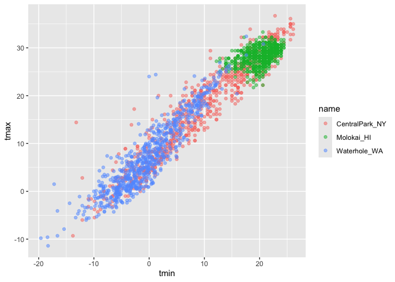
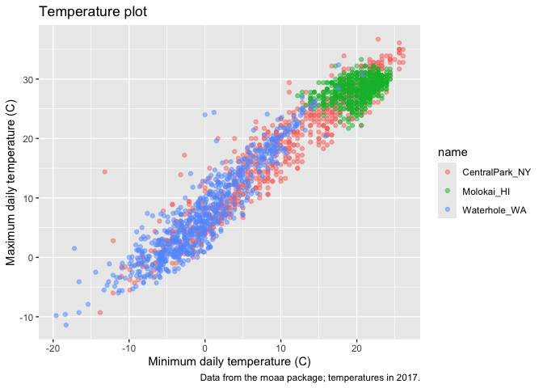
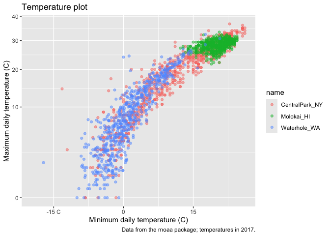
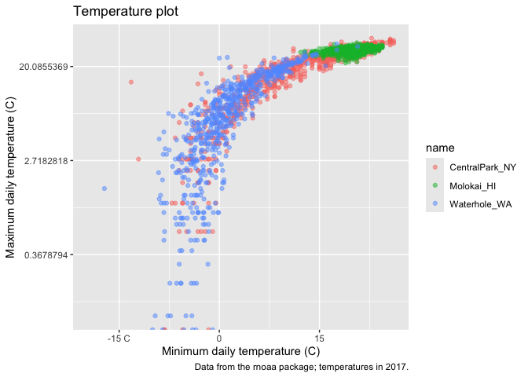
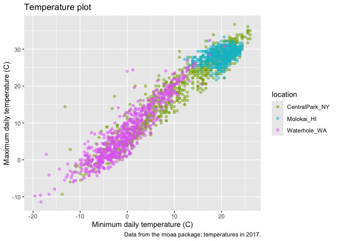
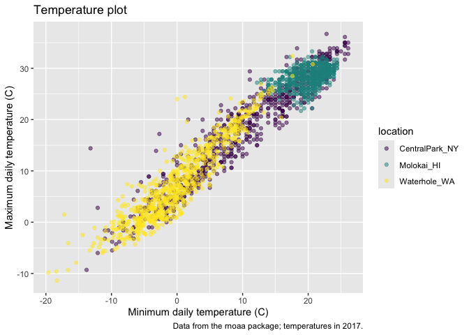
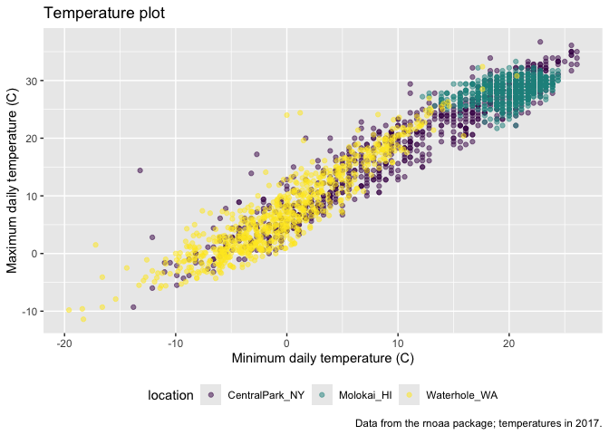
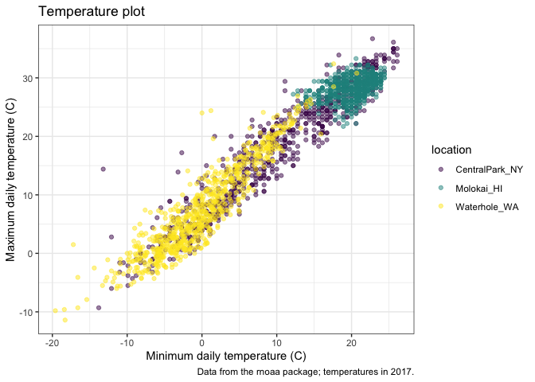
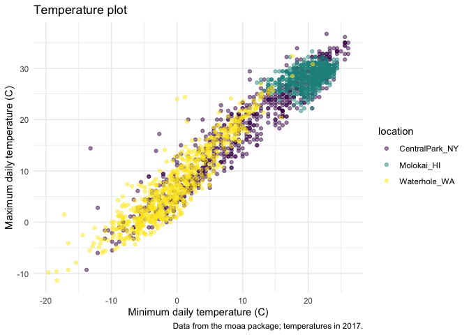

Visualization
================

``` r
library(tidyverse)
```

    ## ── Attaching core tidyverse packages ──────────────────────── tidyverse 2.0.0 ──
    ## ✔ dplyr     1.1.4     ✔ readr     2.1.5
    ## ✔ forcats   1.0.0     ✔ stringr   1.5.1
    ## ✔ ggplot2   3.5.1     ✔ tibble    3.2.1
    ## ✔ lubridate 1.9.3     ✔ tidyr     1.3.1
    ## ✔ purrr     1.0.2     
    ## ── Conflicts ────────────────────────────────────────── tidyverse_conflicts() ──
    ## ✖ dplyr::filter() masks stats::filter()
    ## ✖ dplyr::lag()    masks stats::lag()
    ## ℹ Use the conflicted package (<http://conflicted.r-lib.org/>) to force all conflicts to become errors

``` r
library (patchwork)
```

\##Load the weather data

``` r
weather_df = 
  rnoaa::meteo_pull_monitors(
    c("USW00094728", "USW00022534", "USS0023B17S"),
    var = c("PRCP", "TMIN", "TMAX"), 
    date_min = "2021-01-01",
    date_max = "2022-12-31") |>
  mutate(
    name = case_match(
      id, 
      "USW00094728" ~ "CentralPark_NY", 
      "USW00022534" ~ "Molokai_HI",
      "USS0023B17S" ~ "Waterhole_WA"),
    tmin = tmin / 10,
    tmax = tmax / 10) |>
  select(name, id, everything())
```

    ## using cached file: /Users/Tammy/Library/Caches/org.R-project.R/R/rnoaa/noaa_ghcnd/USW00094728.dly

    ## date created (size, mb): 2024-09-26 20:34:18.576194 (8.651)

    ## file min/max dates: 1869-01-01 / 2024-09-30

    ## using cached file: /Users/Tammy/Library/Caches/org.R-project.R/R/rnoaa/noaa_ghcnd/USW00022534.dly

    ## date created (size, mb): 2024-09-26 20:34:36.21331 (3.932)

    ## file min/max dates: 1949-10-01 / 2024-09-30

    ## using cached file: /Users/Tammy/Library/Caches/org.R-project.R/R/rnoaa/noaa_ghcnd/USS0023B17S.dly

    ## date created (size, mb): 2024-09-26 20:34:42.357773 (1.036)

    ## file min/max dates: 1999-09-01 / 2024-09-30

``` r
weather_df
```

    ## # A tibble: 2,190 × 6
    ##    name           id          date        prcp  tmax  tmin
    ##    <chr>          <chr>       <date>     <dbl> <dbl> <dbl>
    ##  1 CentralPark_NY USW00094728 2021-01-01   157   4.4   0.6
    ##  2 CentralPark_NY USW00094728 2021-01-02    13  10.6   2.2
    ##  3 CentralPark_NY USW00094728 2021-01-03    56   3.3   1.1
    ##  4 CentralPark_NY USW00094728 2021-01-04     5   6.1   1.7
    ##  5 CentralPark_NY USW00094728 2021-01-05     0   5.6   2.2
    ##  6 CentralPark_NY USW00094728 2021-01-06     0   5     1.1
    ##  7 CentralPark_NY USW00094728 2021-01-07     0   5    -1  
    ##  8 CentralPark_NY USW00094728 2021-01-08     0   2.8  -2.7
    ##  9 CentralPark_NY USW00094728 2021-01-09     0   2.8  -4.3
    ## 10 CentralPark_NY USW00094728 2021-01-10     0   5    -1.6
    ## # ℹ 2,180 more rows

## Remember this plot…?

``` r
weather_df %>% 
  ggplot(aes(x=tmin, y=tmax, color=name))+
  geom_point(alpha=0.5)
```

    ## Warning: Removed 17 rows containing missing values or values outside the scale range
    ## (`geom_point()`).

<!-- -->

## Labels

``` r
weather_df %>% 
  ggplot(aes(x=tmin, y=tmax, color=name))+
  geom_point(alpha=0.5) +
  labs(
    title = "Temperature plot",
    x = "Minimum daily temperature (C)",
    y = "Maximum daily temperature (C)",
    caption = "Data from the rnoaa package; temperatures in 2017."
  )
```

    ## Warning: Removed 17 rows containing missing values or values outside the scale range
    ## (`geom_point()`).

<!-- -->

## Scales

Start with the same plot, x and y scales

``` r
weather_df %>% 
  ggplot(aes(x=tmin, y=tmax, color=name))+
  geom_point(alpha=0.5) +
  labs(
    title = "Temperature plot",
    x = "Minimum daily temperature (C)",
    y = "Maximum daily temperature (C)",
    caption = "Data from the rnoaa package; temperatures in 2017."
  ) +
  scale_x_continuous(
    breaks = c(-15,0,15),
    labels = c("-15 C", "0", "15")
  ) +
  scale_y_continuous(
    trans = "sqrt"
  )
```

    ## Warning in transformation$transform(x): NaNs produced

    ## Warning in scale_y_continuous(trans = "sqrt"): sqrt transformation introduced
    ## infinite values.

    ## Warning: Removed 142 rows containing missing values or values outside the scale range
    ## (`geom_point()`).

<!-- -->

``` r
weather_df %>% 
  ggplot(aes(x=tmin, y=tmax, color=name))+
  geom_point(alpha=0.5) +
  labs(
    title = "Temperature plot",
    x = "Minimum daily temperature (C)",
    y = "Maximum daily temperature (C)",
    caption = "Data from the rnoaa package; temperatures in 2017."
  ) +
  scale_x_continuous(
    breaks = c(-15,0,15),
    labels = c("-15 C", "0", "15")
  ) +
  scale_y_continuous(
    trans = "log"
  )
```

    ## Warning in transformation$transform(x): NaNs produced

    ## Warning in scale_y_continuous(trans = "log"): log-2.718282 transformation
    ## introduced infinite values.

    ## Warning: Removed 142 rows containing missing values or values outside the scale range
    ## (`geom_point()`).

<!-- -->

Lets look at color scales

``` r
weather_df %>% 
  ggplot(aes(x=tmin, y=tmax, color=name))+
  geom_point(alpha=0.5) +
  labs(
    title = "Temperature plot",
    x = "Minimum daily temperature (C)",
    y = "Maximum daily temperature (C)",
    caption = "Data from the rnoaa package; temperatures in 2017."
  ) +
  scale_color_hue(
    name = "location" ,
    h = c(100,300))
```

    ## Warning: Removed 17 rows containing missing values or values outside the scale range
    ## (`geom_point()`).

<!-- -->

``` r
weather_df %>% 
  ggplot(aes(x=tmin, y=tmax, color=name))+
  geom_point(alpha=0.5) +
  labs(
    title = "Temperature plot",
    x = "Minimum daily temperature (C)",
    y = "Maximum daily temperature (C)",
    caption = "Data from the rnoaa package; temperatures in 2017."
  ) +
  viridis::scale_color_viridis(
    name = "location",
    discrete= TRUE)
```

    ## Warning: Removed 17 rows containing missing values or values outside the scale range
    ## (`geom_point()`).

<!-- -->

## Themes

Shift the legend

``` r
weather_df %>% 
  ggplot(aes(x=tmin, y=tmax, color=name))+
  geom_point(alpha=0.5) +
  labs(
    title = "Temperature plot",
    x = "Minimum daily temperature (C)",
    y = "Maximum daily temperature (C)",
    caption = "Data from the rnoaa package; temperatures in 2017."
  ) +
  viridis::scale_color_viridis(
    name = "location",
    discrete= TRUE) +
  theme(legend.position = "bottom")
```

    ## Warning: Removed 17 rows containing missing values or values outside the scale range
    ## (`geom_point()`).

<!-- -->

Change the overall theme Adds black line box around

``` r
weather_df %>% 
  ggplot(aes(x=tmin, y=tmax, color=name))+
  geom_point(alpha=0.5) +
  labs(
    title = "Temperature plot",
    x = "Minimum daily temperature (C)",
    y = "Maximum daily temperature (C)",
    caption = "Data from the rnoaa package; temperatures in 2017."
  ) +
  viridis::scale_color_viridis(
    name = "location",
    discrete= TRUE) +
  theme_bw()
```

    ## Warning: Removed 17 rows containing missing values or values outside the scale range
    ## (`geom_point()`).

<!-- -->

Removes grid line outside plot

``` r
weather_df %>% 
  ggplot(aes(x=tmin, y=tmax, color=name))+
  geom_point(alpha=0.5) +
  labs(
    title = "Temperature plot",
    x = "Minimum daily temperature (C)",
    y = "Maximum daily temperature (C)",
    caption = "Data from the rnoaa package; temperatures in 2017."
  ) +
  viridis::scale_color_viridis(
    name = "location",
    discrete= TRUE) +
  theme_minimal()
```

    ## Warning: Removed 17 rows containing missing values or values outside the scale range
    ## (`geom_point()`).

<!-- -->

``` r
weather_df %>% 
  ggplot(aes(x=tmin, y=tmax, color=name))+
  geom_point(alpha=0.5) +
  labs(
    title = "Temperature plot",
    x = "Minimum daily temperature (C)",
    y = "Maximum daily temperature (C)",
    caption = "Data from the rnoaa package; temperatures in 2017."
  ) +
  viridis::scale_color_viridis(
    name = "location",
    discrete= TRUE) +
  theme_minimal() +
  theme(legen.positon = "bottom")
```

    ## Warning in plot_theme(plot): The `legen.positon` theme element is not defined
    ## in the element hierarchy.

    ## Warning: Removed 17 rows containing missing values or values outside the scale range
    ## (`geom_point()`).

<!-- -->

## Setting options

Run this in beginning of R markdown file from now onwards

``` r
library(tidyverse)
knitr::opts_chunk$set(
  fig.width = 6,
  fig.asp = 6,
  out.width = "90%"
)
theme_set(theme_minimal()+ theme(legend.position = "bottom"))

options(
  ggplot2.continuous.color = "viridis",
  ggplot2.continuous.fill = "viridis"
)

scale_colour_discrete = scale_color_viridis_d
scale_fill_discrete = scale_fill_viridis_d
```
